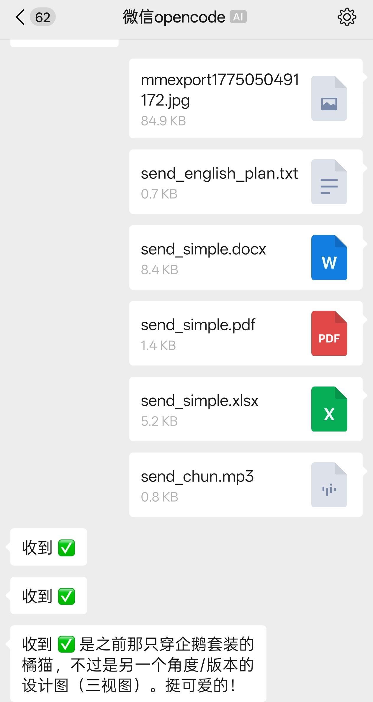
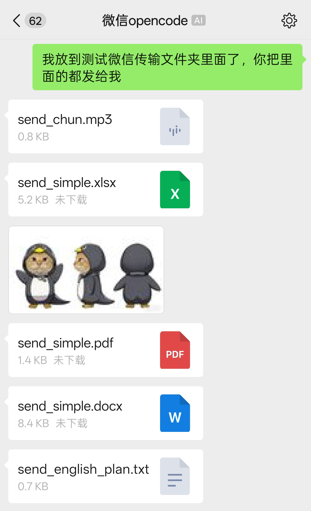
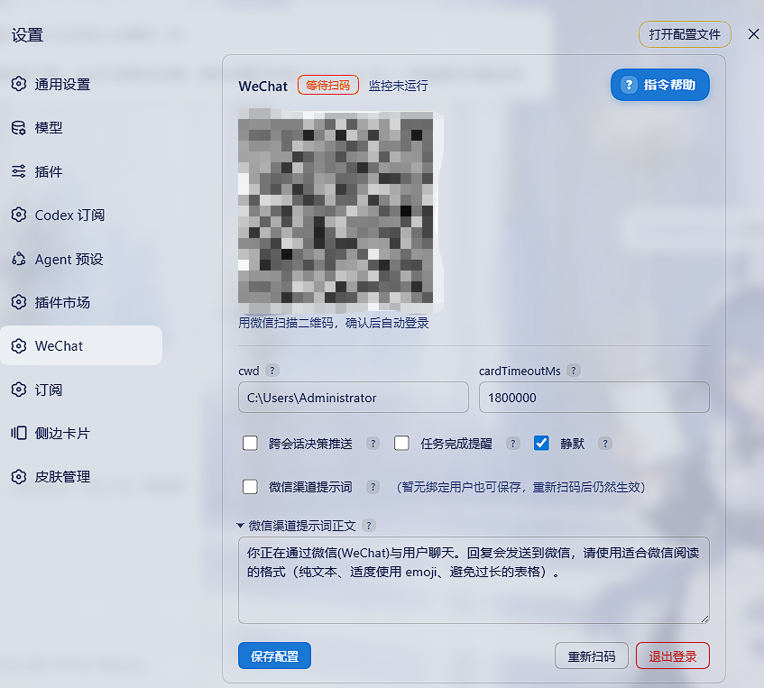

# dsh-wechat

[](https://www.npmjs.com/package/dsh-wechat)
[](https://www.npmjs.com/package/dsh-wechat)
[](https://github.com/pan17/dsh-wechat)

让微信成为 DeepSeek Harness (DSH) 的第二客户端：通过腾讯 iLink bot 协议把
微信私聊桥接到 DSH agent——文本/图片/文件/语音消息双向收发、微信内 slash
命令管理会话/工作区/Preset/模型/权限、审批与提问卡与 GUI 双端同卡同决策、
DSH 设置页内扫码登录与连接配置。以静态 Cordis 插件交付，零运行时
`@deepseek-ai` 依赖，直接调用 DSH 进程内服务。

  

## 功能

- **发送** — 微信文本/图片/文件/语音消息 → DSH agent（媒体自动下载解密到
  `~/.dsh-wechat/tempfile/`，本地路径作为附件注入）
- **接收** — agent 正文独立发送；正文之间的思考与工具调用/结果合并成一条「执行过程」，按桌面端的分组方式阅读。过程在收到下一段正文的第一个有效流式片段时立即推送，正文接收完成后独立发送；提问/审批卡或轮次结束也会发送待发过程；`send_wechat` 工具可主动推送文本/文件到微信
- **出站 Markdown（与官方微信渠道一致）** — 按 [Tencent/openclaw-weixin](https://github.com/Tencent/openclaw-weixin) 的 `StreamingMarkdownFilter` 保留微信能渲染的语法（粗体、链接、H1–H4、代码块、行内代码、引用、分隔线、表格），只移除图片与微信不渲染的标记
- **微信 slash 命令** — `/workspace`、`/session`、`/preset`、`/model`、
  `/perm`、`/silent`、`/notify`、`/next`、`/status`、`/stop`、`/rq` 等
  由 bridge 直接处理（见下方命令表）
- **审批/提问卡（双端同卡）** — 微信与 GUI 弹一致的原生审批/提问卡，
  谁先回复谁生效（原生防双决）
- **微信渠道提示词（动态注入）** — 微信消息注入可配置提示词；GUI 消息时自动消失。设置页可开关/编辑正文，微信 `/surface on|off` 切换
- **静默模式** — `/silent on` 后每轮只发送最终回复，设置页可切换（全局配置，重新扫码后仍保留）
- **繁忙时投递（与 DSH 同源）** — 按 `busyEnter` 排队/插话；微信 `/enter` 同步
- **跨会话决策推送** — `/notify on` 后，任意会话的权限/提问卡整卡推送到微信。当前会话可直接回；其它会话必须 `P{n}=…`（`P1=/rq` 关闭该卡）。默认关。跨会话任务完成/报错走 `/notify tasks on|off`
- **二维码登录** — `http://127.0.0.1:3080/wechat/qr` 扫码登录，设置页内嵌
- **设置页 UI** — DSH 设置 → **WeChat**：单卡展示状态、扫码、退出登录、连接配置与通知/静默开关（保存即生效，存储于 `~/.dsh-wechat/config.json` 与 `state.json`）
- **断点续传** — `sync-buf` 与微信会话映射持久化，重启 DSH 后自动恢复会话
- **单用户** — 只服务第一个微信用户；bot token 缺失/失效时不向微信推送，日志会写明原因（需重新扫码或等会话恢复）

## 安装（部署到 DSH profile）

当前版本要求 **DSH `>=0.2.0-rc.2`**，`engines.dsh` 使用大于等于约束；低于该版本的 DSH 安装时会被拒绝。

### 方式一：设置页内直接安装（推荐）

打开 **设置 → 插件 → 添加插件**，在输入框填包名：

```text
dsh-wechat
```

点「安装」即可。插件声明了 `dsh.bundle`，安装时会被自动注册成 bundle 层，
不需要再手动改 profile 配置。国内网络下载慢时，把「安装源」切到
**中国大陆镜像源**。

安装完成后若提示「已安装，下次启动后加载」，重启 DSH 即可；若出现
「立即启用」按钮，也可以直接点它免重启。

然后浏览器打开 **设置 → WeChat**：扫码登录、查看状态、改配置，或直接访问
`http://127.0.0.1:3080/wechat/qr` 扫码。

### 方式二：命令行

DSH 自带插件管理命令 `dsh plugin`（在 profile 目录转发 pnpm，并自动把
声明了 `dsh.bundle` 的依赖加入 bundle 层）：

> ⚠️ **别用** `npx dsh plugin`——npm 上 `dsh` 这个名字早在 2016 年就被一个不相关的 JS shell 包占了（`dsh@1.0.1`，作者 `infusion`），它没暴露 CLI bin，会报 `could not determine executable to run`。DSH 的 CLI 在 scoped 包 `@deepseek-ai/dsh` 下，必须用完整名。

桌面版（Electron）用户请直接用应用自带的 `dsh` 命令（安装桌面版时会加入 PATH），
它支持 `--profile desktop`：

```bash
# 安装（自动添加依赖 + 注册 bundle 层）
dsh plugin --profile desktop add dsh-wechat

# 查看已装版本
dsh plugin --profile desktop list --depth 0

# 重启 DSH
```

其他管理命令（同样自动维护 bundle 层）：

```bash
dsh plugin --profile desktop update dsh-wechat   # 升级
dsh plugin --profile desktop remove dsh-wechat   # 卸载（从 bundles 移除）
```

> `--dump-config` 在 `desktop` profile 上会被拒绝（该 profile 由 Electron 应用
> 独占管理），要验证组合配置请改用 `dsh plugin --profile desktop list`，
> 或在设置页查看。
>
> 非桌面版（`web` / `tui` / `headless` 等自建 profile）用 scoped CLI：
>
> ```bash
> npx @deepseek-ai/dsh plugin --profile web add dsh-wechat
> npx @deepseek-ai/dsh --profile web --dump-config   # 应看到 "- id: dsh-wechat" 行
> ```

> 插件从 npm 官方源安装（`dsh plugin add` 即 `pnpm add dsh-wechat`）。
> 修改代码后需**重启 DSH** 才能让改动生效。

## 微信命令

### 与 DSH 原生命令同步

<details>
<summary>点击展开：bridge 如何接入 DSH 的 <code>ctx.commands</code> 注册中心（计划模式 / 目标 / 压缩 等原生 slash 命令走的就是这条路）</summary>

微信消息进入后，bridge **先**向 DSH 的 `ctx.commands` 注册中心查询当前会话
已注册的命令（这是 DSH 内置的人类 slash 命令注册服务，由 `@deepseek-ai/dsh-commands`
提供；`name` /plan、`name` /goal、`name` /compact 等命令都由各自的 bundle 在那里
注册）。命中即直接交给原生 handler 执行，并把结果回执渲染到微信——和 GUI 走同
一条命令管线。

未注册的命令回落到本仓库硬写的本地命令表（`/silent`、`/next`、`/rq`、
/workspace、`/session` 等），命中失败时按 "未知命令" 提示并作为文本转发给 agent。
DSH 的 `ctx.commands` 服务在某些极简装配下可能不挂载（缺失时会打一次 warn），
这种情形行为完全等同之前的版本。

所以：**DSH 加任何新的 `/xxx` 命令 bundle，微信端无需改动即可识别**——只要它是
按 DSH 命令注册契约挂上去的。例如装有 `dsh-plan-mode` 时微信发 `/plan off` 收
到原生回执 "Plan mode off."；装有 `dsh-command-goal` 时 `/goal <目标>` 收到原生
"Goal created ..."；装有 `dsh-command-compact` 时 `/compact` 收到 "Compacted N
history items (~M tokens)."——与 GUI 同款回执，由原生 handler 自己算、自己发。

`/help` 在末尾加一段 `── DSH 原生命令（当前 profile 已注册）──`，列出当前
profile 实际注册的所有原生命令；本地命令表里已有的名字自动去重，不会重复
出现。

</details>

### 本地命令表

| 命令 | 说明 |
|---|---|
| `/help`（`/h`、`/?`） | 帮助 |
| `/status` | 当前状态：工作区、会话、Agent、待处理(当前)/待处理(跨会话)、当前会话 Preset、模型、上下文、权限、默认 Preset、静默、繁忙投递、跨会话决策推送、跨会话任务完成提醒；末尾追加 DSH 通过 `ctx.sessionProjections` 注册的所有会话级状态，分四段显示——`[模式]`（plan / goal / subagent / todos）、`[用量与统计]`（tokenUsage / contextPressure / contextBreakdown / sessionStats / subagentTiming）、`[会话]`（title / sessionListMetadata / permissions / imageLimits）、`[其它]`（未识别 key 自动归类）；DSH 加新 plugin 自动出现 |
| `/workspace (ws) — list \| status \| switch <编号\|路径> \| add <路径>` | 工作区管理（list 显示各工作区会话数，不含已归档；switch/add 回复会写明恢复的会话名字和完整 id，跳过已归档；该目录无可见会话时提示发送消息将创建） |
| `/session (s) — list [current] \| switch [current] <编号> \| new \| status` | 会话管理（list 最近 20 个，标记当前，不显示 GUI 已归档会话；`list current` 只看当前工作目录，推荐用 `switch current <编号>` 按同一列表切换；紧接着直接 `switch <编号>` 也会复用最近一次列表编号；普通无列表上下文时 `switch <编号>` 对应全量列表；switch 回复同时带会话名字和完整 id；`new` 复用当前工作区空白会话，与 GUI「新建会话」同款，无空白才新建） |
| `/preset (p) — list \| switch <名称\|编号> \| status` | 默认 Preset（写入 DSH 设置，与 GUI 同步；`status` 看全局默认，不是当前会话；当前会话无内容时 `switch` 立即应用） |
| `/model — list [提供商] \| switch <提供商/模型> \| status` | 模型管理（切换立即作用于当前会话 + 设为默认；当前推理等级若新模型支持则一并保留，否则清空） |
| `/perm — status \| list \| switch <名称\|编号> \| default [名称\|编号]` | 权限管理（switch 实时切当前会话；default 写 DSH 设置，新会话生效） |
| `/reasoning — [list \| default \| switch <等级>]` | 推理等级：查看当前/默认与模型支持的等级；`switch <等级>` 切换（实时 + 写默认）；`default` 恢复模型默认 |
| `/enter queue\|steer\|status`（`/busy`） | 繁忙时投递：agent 运行中收到微信消息时排队（`queue`）还是插话进当前轮次（`steer`）；读写 DSH 设置 `ui-conversation.busyEnter`，与 GUI「繁忙时 Enter 键行为」同源同步；空闲会话始终新开一轮 |
| `/silent on\|off`（`/sl`） | 静默模式：开启后仅在轮次结束发送最后一条助手正文；关闭后思考与工具合并为「执行过程」，正文独立发送；写入 `config.json`，重新扫码后仍保留，设置页可切换 |
| `/surface on\|off\|status`（`/wxprompt`） | 微信渠道提示词注入开关（默认关）；正文在设置页编辑，不在微信改 |
| `/notify on\|off\|status`（`/watch`） | 跨会话决策推送总闸（开：任意会话权限/提问卡整卡推送并可直接回复；关：只答当前会话），默认关闭；`/notify tasks on\|off` 单独开关跨会话任务完成/报错提醒（设置页可切换） |
| `/history [all] [数量]` | 查看最近历史（默认 5 条，最多 20 条；默认只看你和助手，`all` 含压缩检查点/插件注入等系统消息）；当前可回答的提问/权限卡会完整重发（决策推送开启时含其它会话） |
| `/stop` | 中断当前任务 |
| `/next` | 继续发送因微信限制被缓存的消息 |
| `/rq` | 关闭当前会话的待处理卡（提问+权限）；其它会话用 `P1=/rq` |

其他 `/xxx` 命令作为文本转发给 agent；审批/提问卡双端同弹，已在其他端
处理的卡会提示。

所有命令均直接映射 DSH 原生服务（`workspaceRegistry` / `sessionQuery` /
`agentPresets` / `agentDefaultModel` / `permissionPresets`），默认值与 GUI
设置页同源同步。

## 架构

```
微信 (iLink) ── long-poll getupdates ──► dsh-wechat (Cordis host plugin)
    ▲                                      │
    │ ◄── sendText/sendMedia ──────────────┤
    │                                      ▼
    │                          DSH 进程内服务（零 @deepseek-ai 运行时依赖）
    │        agents.create/resume ── agent.followup（消息入）
    │        session/event ── assistant/message、turn/end（消息出）
    │        approval/request · user-questions/request waterfall ── 审批/提问卡（镜像 GUI，谁先答谁生效）
    │        tools.register ── send_wechat 工具
```

> 设计说明：微信端是 GUI 的**第二客户端**，功能不多也不少。

## 设置页（DSH 设置 → WeChat）

客户端半部通过 `dsh.client` + `exports["./client"]` 声明（与 dsh-mcp-manager
同款交付），挂载到 `settings.section` slot（nav 顺序 40）：

- **状态卡** — 登录阶段（未登录/等待扫码/已扫码，待确认/已登录/登录失败）、Bot ID、
  监控运行状态、已绑定用户数，与 `跨会话决策推送` / `跨会话任务完成提醒` / `静默` 开关同卡展示
- **扫码** — 未登录时页面内直接显示二维码，扫码确认后自动进入已登录
- **操作按钮** — `重新扫码`（清除 token 重新登录）、`退出登录`，与保存配置同行
- **连接配置** — 设置页只展示 `cwd` / `cardTimeoutMs`，以及 `跨会话决策推送` / `跨会话任务完成提醒` / `静默` / 微信渠道提示词（开关 + 正文）；保存即生效。`baseUrl` / `cdnBaseUrl` / `botType` / `textChunkLimit` 仍可写 `~/.dsh-wechat/config.json` 或插件行 `config:`，设置页保存不会覆盖它们。网关参数变更会自动重启长轮询；存储于 `~/.dsh-wechat/config.json` 与 `state.json`
- **帮助** — 卡片标题行的 **帮助** 按钮展开本地命令表（与微信 `/help` 同源）；DSH 原生命令仍只在微信 `/help` 末尾按当前 profile 列出

与宿主通信走插件自己的 HTTP API（`/wechat/api/status|help|config|relogin|
logout`），客户端零 `@deepseek-ai` 依赖。

## 配置

优先级：内置默认 ← 插件行 `config:` ← `~/.dsh-wechat/config.json`
（设置页写入，覆盖前两者）。插件行可带 `config:`：

```yaml
# 例：追加到 profile 的 cordis.patch.yml
- id: dsh-wechat
  config:
    cwd: 'C:\projects\my-project'
```

| 键 | 默认值 | 说明 |
|---|---|---|
| `baseUrl` | `https://ilinkai.weixin.qq.com` | iLink 网关 |
| `cdnBaseUrl` | `https://novac2c.cdn.weixin.qq.com/c2c` | 媒体 CDN |
| `botType` | `"3"` | iLink bot 类型 |
| `storageDir` | `~/.dsh-wechat` | token/sync-buf/会话映射/临时文件 |
| `cwd` | `process.cwd()` | 新会话工作目录 |
| `textChunkLimit` | `4000` | 微信单条消息长度上限 |
| `cardTimeoutMs` | `1800000` | 提问/权限卡软超时（30 分钟） |
| `crossSessionNotify` | `false` | 跨会话决策推送总闸（任意会话的权限/提问卡整卡推送，微信直接回复） |
| `notifyTaskEvents` | `false` | 跨会话任务完成/报错提醒（独立于决策推送，默认关） |
| `silent` | `false` | 静默模式总闸（只发每轮最终回复；重新扫码后仍保留） |
| `surfacePromptEnabled` | `false` | 微信渠道提示词总闸（微信消息驱动时注入，GUI 消息时仍隐藏） |
| `surfacePrompt` | 见默认中文 | 注入正文（设置页编辑；含 `{{` 会被打散以免打断 DSH interpolate） |

## 开发

```bash
npm install
npm run build    # tsc → dist/
npm test         # vitest（splitText/出站 Markdown 过滤/解析/帧处理/waterfall 竞速/状态存储/命令解析/超时恢复/状态颜色/历史截断/渠道提示词/DSH >=0.2.0-rc.2 适配）
```

当前版本针对 **DeepSeek Harness `>=0.2.0-rc.2`** 的宿主 API；仓库本身不依赖任何 `@deepseek-ai/dsh-*` 运行时包。

## 已知边界

- 出站文本按官方微信渠道（[Tencent/openclaw-weixin](https://github.com/Tencent/openclaw-weixin)）的 `StreamingMarkdownFilter` 处理，而不是一律剥掉 Markdown：`**粗体**`、链接、H1–H4 标题、代码块（```）、行内代码、引用（`>`）、分隔线（`---`）与表格都原样发送；只去掉微信不渲染的部分——图片（`` 整段移除）、H5/H6 标题标记，以及包裹中文的单个 `*`/`_`/`***`/`___` 强调标记（内容保留）。
- 微信「执行过程」是单条普通文本消息，没有桌面端的折叠交互。内容采用桌面端收起条目的规则：思考首行、中文工具标题与路径/描述，成功输出隐藏、失败仅一行错误、任务清单显示完成计数与变更；长分组标明省略数量，可在 DSH 查看完整记录。过程仅覆盖当前绑定会话，静默时隐藏；已推送过程与正文共享发送额度，超限走 `/next`。未推送的过程分组不跨进程重启保存。
- 审批/提问卡挂在 Host 的 `approval/request` 与 `user-questions/request`
  waterfall 上，与 GUI 竞速；无微信 peer 时立即 `next()`，软超时只撤微信卡、不替用户决策。微信先答时会 abort 传给 GUI 的 `request.signal`（不碰 turn 的 `exec.signal`），Web composer 卡随 Gateway `cancel` 帧收起。DSH 重启后未决卡片随 turn 消失（上游已知限制）。
- `send_wechat` 工具对所有 agent 可见；任何会话的 agent 都能调用——绑定会话发送到绑定用户，未绑定会话回退到首个已知微信用户（单用户部署默认行为）。
  单用户模式下，工具推送与 assistant 回复共享唯一一份微信 10 条/窗口限流预算：超限或发送失败自动进入 `/next` FIFO 缓存队列。计数和队列持久化到 `state.json`，普通 DSH 更新或重启后继续沿用；下一条微信入站会重置窗口并自动补发。微信真实限流响应（HTTP 200 + `ret: -2` / `prepare failed`）也会被识别并缓存，不再误判成功。
- `/preset switch` 遵循 DSH 约束：只有未产生任何内容的会话才能当场
  `recompose`；已有内容的会话会提示 Preset 应用于下一个新会话。默认
  Preset 本身写入 DSH 设置文档（`agent-presets` namespace），GUI 设置
  页与微信双端读写同一事实源。
- 入站重投按微信用户 + 服务端 `message_id`（缺失时用有效 `seq`）去重，缓存保留 30 分钟、最多 4096 条，作用于当前插件实例；重连保留缓存，退出登录/重新扫码清空。无有效身份的消息放行，相同文本但不同身份的消息正常处理。去重缓存不跨进程重启持久化，也不协调同时配置的多个插件实例。
- 同一用户的会话检查与创建串行执行，避免首次收消息或工作区无绑定时并发创建多个会话。停止/重连会取消正在进行的长轮询，丢弃旧轮询迟到的消息；重连等待旧轮询退出后启动新轮询。
- iLink 通道是腾讯官方 bot 协议，接口可能随官方调整；跟随 wechat-opencode
  上游的 `src/weixin/` 修复即可。

## 许可

MIT。`src/weixin/`、`src/adapter/` 移植自
[wechat-opencode](https://github.com/pan17/wechat-opencode)（MIT，
原始来源 `@tencent-weixin/openclaw-weixin`），文件头保留出处注释。

## 免责声明

本项目与 DeepSeek Harness、腾讯微信官方**互不隶属**，非官方项目，
纯属个人学习用途。使用本项目即表示你自行承担由此产生的一切后果。
